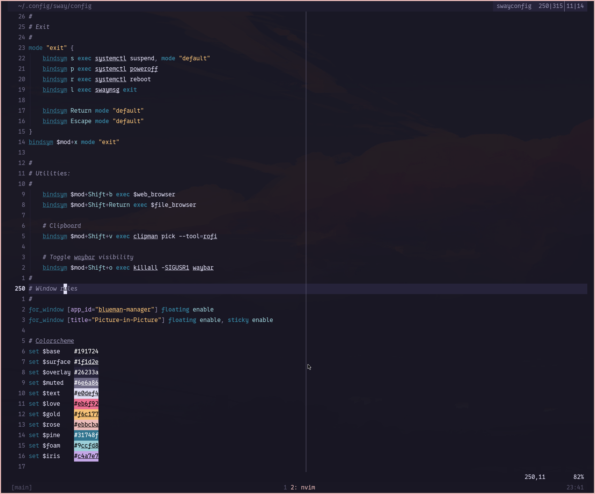

# Neovim Configuration

Minimal Neovim setup with LSP, formatting and linting for
Rust, Golang, TypeScript, Lua and more.

_Based on [kickstart.nvim](https://github.com/nvim-lua/kickstart.nvim) as a reference._



## Requirements

- Neovim >= 0.11.0
- Git
- A [Nerd Font](https://www.nerdfonts.com/)
- Language toolchains: Rust, Go, Node.js (for respective language support)

### For blink.cmp Rust Fuzzy

This config uses blink.cmp's faster Rust implementation for fuzzy matching.

#### Prerequisites

- Download the pre-built binary for your system from [latest release](https://github.com/Saghen/blink.cmp/releases/latest)
- Find your Neovim data directory:

```bash
# Run this in Neovim
:echo stdpath('data')
# Example output: /home/user/.local/share/nvim
```

- Create the directory and move the binary

```bash
mkdir -p ~/.local/share/nvim/lazy/blink.cmp/target/release
mv ~/Downloads/x86_64-unknown-linux-gnu.so
 ~/.local/share/nvim/lazy/blink.cmp/target/release/libblink_cmp_fuzzy.so
```

## Installation

```bash
# Backup existing config
mv ~/.config/nvim ~/.config/nvim.backup

# Clone this repo
git clone https://github.com/akr411/neovim-config.git ~/.config/nvim

# Start Neovim
nvim
```

## Features

- LSP: Mason + nvim-lspconfig
- Completion: blink.cmp with snippet support
- Formatting: conform.nvim (format on save)
- Linting: nvim-lint with auto-linting
- Syntax: Treesitter
- Fuzzy find: fzf-lua for files, grep, LSP symbols
- UI: rose-pine colorscheme, mini.statusline, fidget.nvim for LSP progress

## Languages Supported

- Rust (rust-analyzer, rustfmt)
- Go (gopls, goimports, golangci-lint)
- TypeScript/JavaScript (ts_ls, eslint_d, prettierd)
- HTML/CSS (html, cssls, prettierd)
- Lua (lua_ls, stylua)
- Python (pyright, black, ruff)
- Bash (bashls, shellcheck, shfmt)
- Markdown (marksman, markdownlint-cli2, prettierd)
- TOML (taplo)

## Acknowledgments

This configuration was build with reference to
https://github.com/nvim-lua/kickstart.nvim.

## License

MIT
